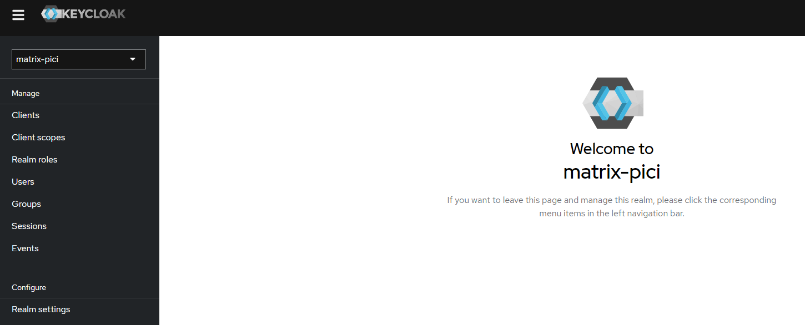
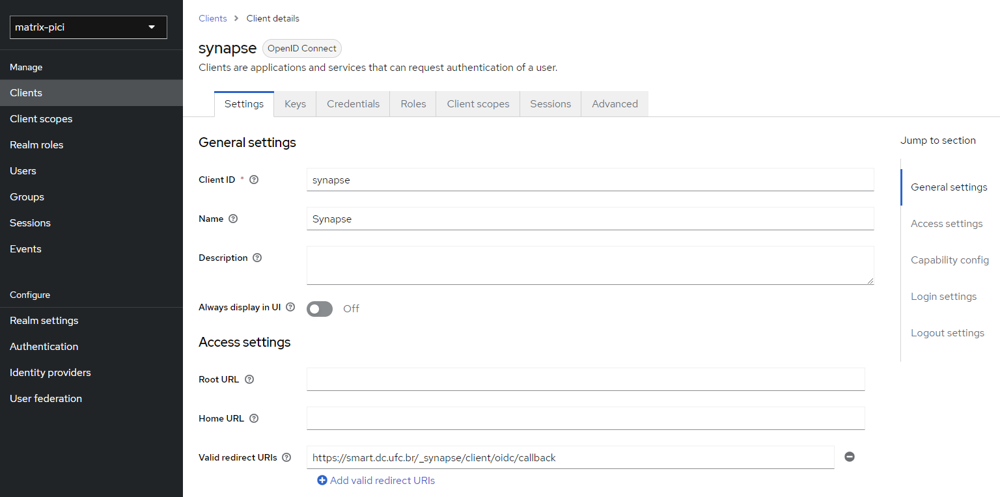
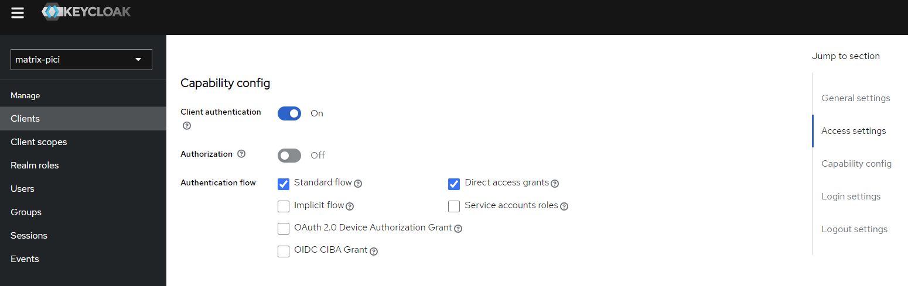
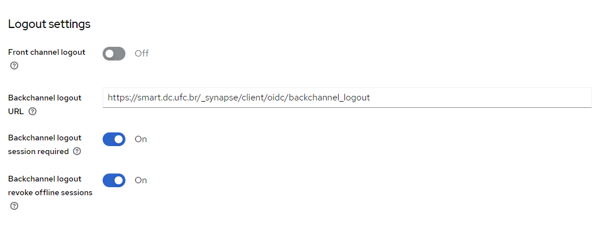

# Setting up Synapse SSO with Keycloak

In this document, will explain SSO(Single Sign-on) implementation with the Matrix Synapse server. For this, we will use Keycloak. Keycloak is an open-source identity and access management (IAM) solution that provides single sign-on (SSO), user authentication, and authorization services for applications and services.

# Prerequisites

## Docker and Docker Compose

To keep things simple both components will be run using [Docker](https://www.docker.com). **Docker** is a container
technology which allows to different components isolated into their respective environments.

-   To install Docker on Windows follow the instructions [here](https://docs.docker.com/docker-for-windows/)
-   To install Docker on Mac follow the instructions [here](https://docs.docker.com/docker-for-mac/)
-   To install Docker on Linux follow the instructions [here](https://docs.docker.com/install/)

**Docker Compose** is a tool for defining and running multi-container Docker applications. A
[YAML file](https://raw.githubusercontent.com/Fiware/tutorials.Entity-Relationships/master/docker-compose.yml) is used
configure the required services for the application. This means all container services can be brought up in a single
command. Docker Compose is installed by default as part of Docker for Windows and Docker for Mac, however Linux users
will need to follow the instructions found [here](https://docs.docker.com/compose/install/)

You can check your current **Docker** and **Docker Compose** versions using the following commands:

```bash
docker-compose -v
docker version
```

Please ensure that you are using Docker version 20.10 or higher and Docker Compose 1.29 or higher and upgrade if
necessary.

# Certificate generation with Lets Encrypt

## 1. Install certbot

If our Matrix server wants to connect with the SSO provider we should run both the Matrix server and Keycloak in https and configure with SSL certificate. 

First you will need to install certbot. This depends on the Linux distro you are using. For example, for apt-based distros such as Debian or Ubuntu, you can just run the following:

```bash
apt install certbot
```
  
## 2. Create HTTPS certificates

Set up certificates:

```bash
certbot certonly --standalone
```

Save the `cert.pem` and `privkey.pem` files into /certs directory

## 3. Change certs directory owner

In order to use the certificate, we need to transfer certs ownership to UID 1000

```bash
chown -R 1000:1000 certs/
```

# Run Keycloak

To run Keycloak just run:

```bash
docker compose up -d
```

Keycloak runs in 5000 port. 

# Keycloak Configuration

## Create a Realm



Here I have created a realm called `matrix-pici`. Once you created the realm then choose the realm after logging in. After choosing the realm do all other activities such as creating new clients and users

## Create a new Client







The above three screenshots are examples of creating a client and configuring with matrix synapse callback.

We have to give a valid redirect URL [synapse public baseurl]/_synapse/client/oidc/callback.

## Create users

Create users by clicking the Users menu. Using the same user, we can log in to our application.

# Synapse configuration

Open homeserver.yaml file and add the below configuration lines for SSO implementation.
